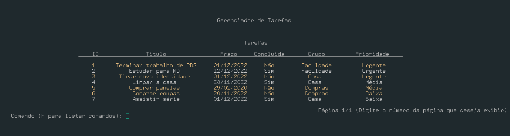
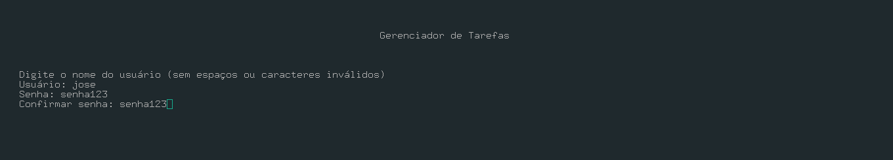
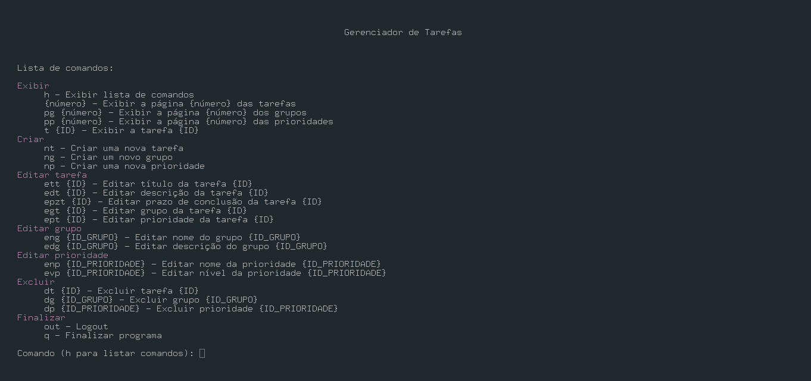

# Gerenciador de Tarefas by: Guilherme Novais and Gabriel Liberato

## Objetivo
O objetivo desse projeto é gerenciar tarefas de múltiplos usuários, permitindo que cada usuário crie, edite e exclua suas tarefas de forma independente.

## Funcionalidades

### Usuários
O programa permite que os usuários criem contas, nas quais serão armazenadas as tarefas de cada um. Deve-se informar um usuário e uma senha, que serão usados para fazer login na conta.

### Comandos
Uma vez logado, o usuário pode inserir comandos para executar ações em sua conta. Pode-se pressionar 'h' para exibir uma lista com todos os comandos válidos.

### Tarefas
Cada tarefa é composta por um conjunto de parâmetros, que devem ser informados durante a criação da tarefa. Todos esses parâmetros podem ser editados após a tarefa ter sido criada.

#### Título
Título da tarefa.

#### Descrição
Descrição da tarefa. É mostrada apenas ao exibir a tarefa individualmente.

#### Prazo
Data limite para a conclusão da tarefa. Tarefas atrasadas são exibidas em amarelo.

#### Concluída
Se a tarefa já foi concluída ou não. Tarefas concluídas são exibidas em um tom mais claro.

#### Grupo
Grupo ao qual a tarefa pertence. Possui um nome e uma descrição. Deve ser criado antes da tarefa.

#### Prioridade
Prioridade da tarefa. Possui um nome e um valor que identifica sua prioridade (valores mais baixos indicam uma prioridade maior). Tarefas com maior prioridade são exibidas primeiro. Deve ser criada antes da tarefa.

Além disso, cada tarefa, prioridade e grupo recebem um ID do programa, que serve para acessá-los, editá-los ou excluí-los.

## Implementação

### Storage
A solução encontrada para gerenciar múltiplos usuários foi armazenar a conta de cada usuário em um arquivo do texto, cujo nome é o nome do usuário e a primeira linha é a senha.
Foi desenvolvida uma classe "Storage", que é responsável por criar, ler, manipular e excluir esses arquivos.
Após o usuário fazer login, suas tarefas, prioridades e grupos são guardadas no Storage em vetores, para facilitar seu acesso.

### Tarefas
As tarefas são manipuladas pelo programa usando objetos da classe Tarefa, que armazenam seus atributos.

### Etiquetas
Cada tarefa deve estar associada a uma prioridade e um grupo, que são herdados da classe Etiqueta. Cada etiqueta armazena o número de tarefas associadas a ela.

### Usuários
A classe usuário é responsável por instanciar o Storage e fazer a validação do usuário. Após ser validado, armazena o nome do usuário logado.

### Terminal
O terminal é responsável pela comunicação entre o usuário e o programa. Ele exibe instruções, recebe comandos do usuário e, caso sejam válidos, chama as funções do storage responsáveis por executar as ações necessárias e exibe o retorno desses comandos. Também exibe mensagens de erro no caso de entradas inválidas.

## Principais dificuldades

### Exibição do terminal em uma formatação agradável
Foi necessário muita pesquisa para desenvolver um terminal que exibisse textos com caracteres especiais e coloridos e que se adaptasse ao tamanho da tela. Um dos maiores desafios foi exibir textos centralizados com caracteres especiais. Para isso, deve-se considerar que um caractere especial ('ç', letras acentuadas, etc) é composto por dois bytes negativos, o que faz com que o método size() da string retorne um valor indesejado. Desenvolvemos uma função que faz a contagem correta.

### Edição de arquivos
Editar arquivos de texto é um pouco complicado, pois não se pode apenas substituir uma linha por outra diretamente. Deve-se copiar as linhas do arquivo para um vetor de strings, fazer as modificações necessárias e criar um novo arquivo com as modificações. Por fim, deve-se substituir o arquivo antigo pelo novo arquivo.

### Comparação da data atual com o prazo da tarefa
Precisamos de bastante pesquisa para encontrar uma forma de obter a data atual do sistema, usando os tipos 'time_t' e 'tm', e comparar com o prazo da tarefa. Também tivemos que implementar uma função para validar os prazos fornecidos, evitando que o usuário informasse uma data inválida.
